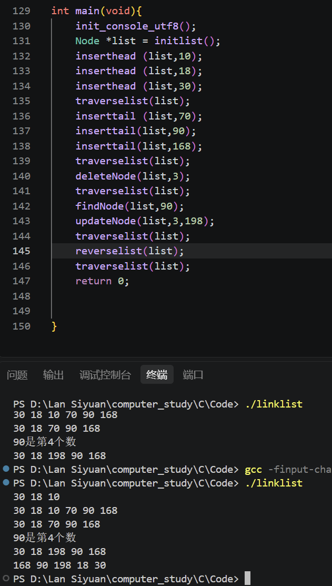

# Step 1. 指针与结构体
## 什么是指针？
1. 指针的定义方法为数据类型 \*指针变量名，如`int *p` `float *a` `char *c`等，指针变量本身大小在64位系统中占8字节内存，而\*指针变量名大小不是固定的，与数据类型有关，`*p`如果是`int`类型，一般为4字节，而`*c`如果是`char`类型就只占一字节
2. 输出结果是`20 10`,因为变量`p`指向`x`的地址，那么`*p = 20`就等价于`x = 20`，而`int *q = arr`就等价于`int *q = &arr[0]`即变量`q`指向数组`arr[0]`的地址，所以`++*arr`就是`*arr[0] + 1`,`*++q`就是`*arr[1]`,所以`int y = 4 + 6`，所以输出结果是20 10
3. 野指针是没有指向有效对象的指针一般是未初始化的指针，是内存释放后所指对象失效的悬空指针在广义上也可归类于野指针，危害是解引用野指针会导致数据异常，出现随机结果或未定义行为，乃至程序崩溃
4. C代码
```c
# include<stdio.h>
void swap(int *a, int *b)
{
   int temp = *a;
   *a = *b;
   *b = temp;
}
int main(void)
{
   int x = 3;
   int y = 5;
   swap(&x,&y);
   printf("%d,%d",x,y);
    return 0;
}
```
## 什么是结构体
1. ```c
   typedef struct Perlnfo{
   char name[10];
   char gender;
   int age;
   double height;
   }information;
   ```
2. 结构体指针是保存结构体变量地址的指针。例如 `struct Student *p = &s;`，其中 `p` 指向结构体变量 `s`。通过结构体指针访问成员可使用`p->member`，等价于 `(*p).member`。
3.  结构体内存对齐规则是结构体成员按照声明顺序存放，每个成员通常需要从满足自身对齐要求的地址开始。若当前位置不满足要求，编译器会加入填充字节（padding）。结构体所有成员存放完成后，其总大小通常还要补齐为最大对齐要求的整数倍。 
该结构体的内存布局如下：  

| 成员 | 偏移范围 | 大小 |
| --- | --- | --- |
| `name` | 0~9 | 10 字节 |
| `gender` | 10 | 1 字节 |
| `padding` | 11 | 1 字节 |
| `age` | 12~15 | 4 字节 |
| `height` | 16~23 | 8 字节 |

因此该结构体共占 **24 字节**。
# 链操作
## 什么是链表
1. 数组是一组同类型元素的集合，在内存中占据的空间是连续的，每个节点只存数据，支持通过下标快速访问，但是大小较为固定不方便扩展，链表则由多个节点组成，每个节点是由数据和指针结合形成，在内存空间中不连续，较为方便增删
2. 单向链表的每个节点通常由数据域和指针域两部分组成，每个节点只能通过 next 指向后一个节点，因此只能沿一个方向依次访问；最后一个节点的 next 为 NULL。
## 实现基本的链操作


[代码](../../Code/linklist.c)
